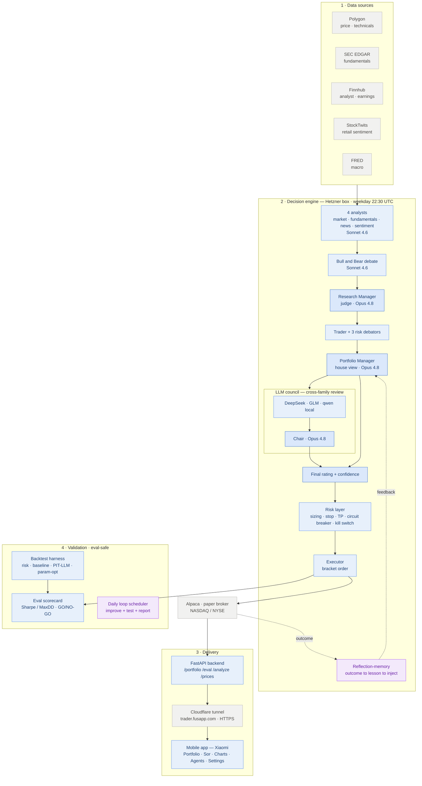

# Current architecture (live)

What is actually deployed and running today — distinct from the planned AWS
design in [`ARCHITECTURE.md`](ARCHITECTURE.md). The live system runs entirely
on a single Hetzner box, with an LLM debate-plus-council decision engine that
learns from its own outcomes (reflection-memory), a deterministic risk layer,
and a React Native app.

> Status: paper-trading eval phase. No real money until the eval scorecard
> clears the ADR-005 gate. Forward paper is the only clean test of the signal.

## System diagram

A static render is also kept at [`architecture-current.svg`](architecture-current.svg).

## Layers

| Layer | What runs | Notes |
|---|---|---|
| **Data** | Polygon, SEC EDGAR, Finnhub, StockTwits, FRED | External APIs, fetched fresh each run |
| **Decision engine** | 7-agent pipeline → LLM council → risk layer → executor | On the Hetzner box; reflection-memory learns from outcomes |
| **Delivery** | FastAPI → Cloudflare tunnel → mobile | HTTPS, reachable on any network |
| **Validation** | backtest harness, eval scorecard, daily loop | Deterministic backtests are leakage-free; LLM backtests are indicative only |

## Models

| Role | Model |
|---|---|
| Research Manager, Portfolio Manager, council chair | Opus 4.8 |
| Analysts, researchers, trader | Sonnet 4.6 |
| Council voters | DeepSeek, GLM (OpenRouter) + qwen2.5 (local ollama) |
| Heuristic agents (cost-opt branch, not deployed) | Haiku 4.5 |

## Where it runs

Everything executes on one Hetzner box (`167.233.102.179`): the systemd timer,
the agent pipeline, ollama, the FastAPI backend, the cloudflared tunnel, SQLite,
the reflection-memory store, and the backtest harness. The box calls out to the
LLM providers, the data APIs, and Alpaca. The phone is just the UI.

## Honesty notes

- LLM backtests suffer information leakage (the model trained on the test
  window) — indicative only; forward paper is the clean test.
- No demonstrated edge yet; the eval scorecard is the gate before real capital.
  See [`adr/005-risk-management.md`](adr/005-risk-management.md).
